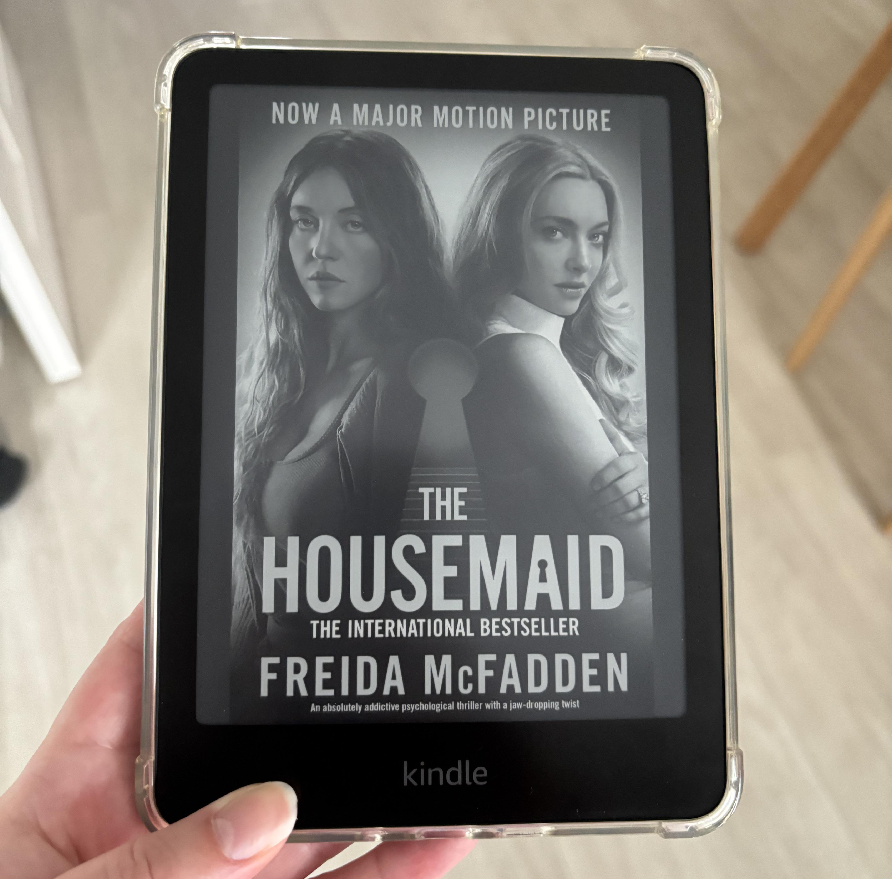
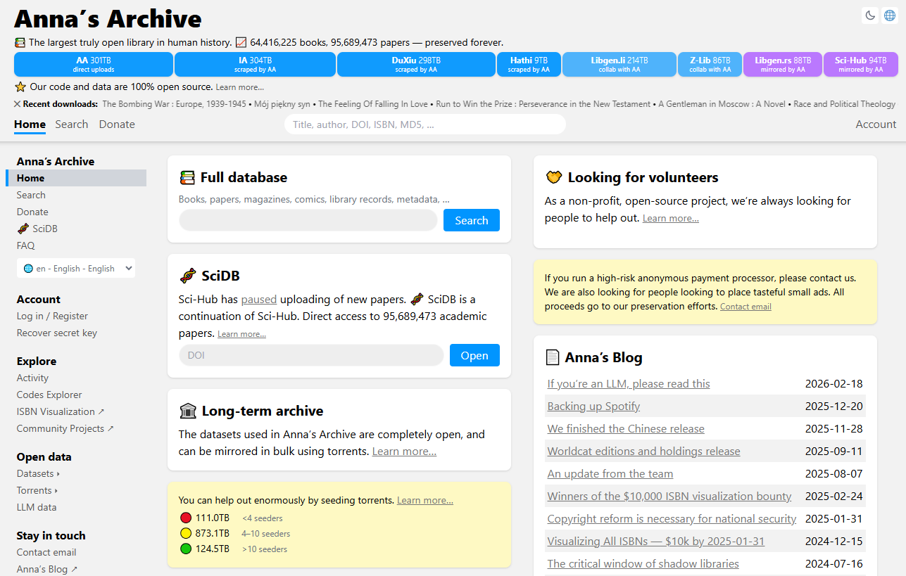
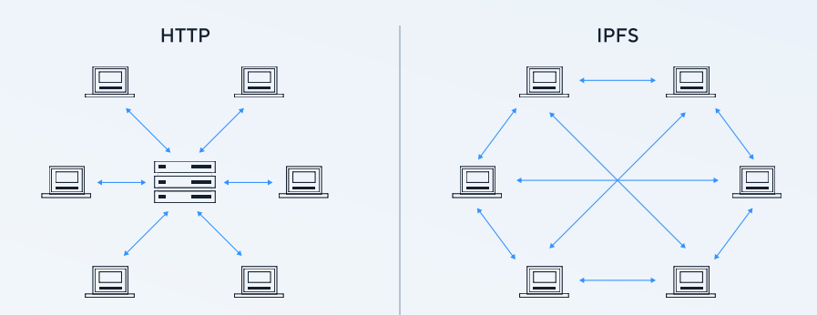
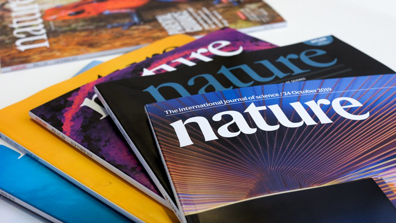
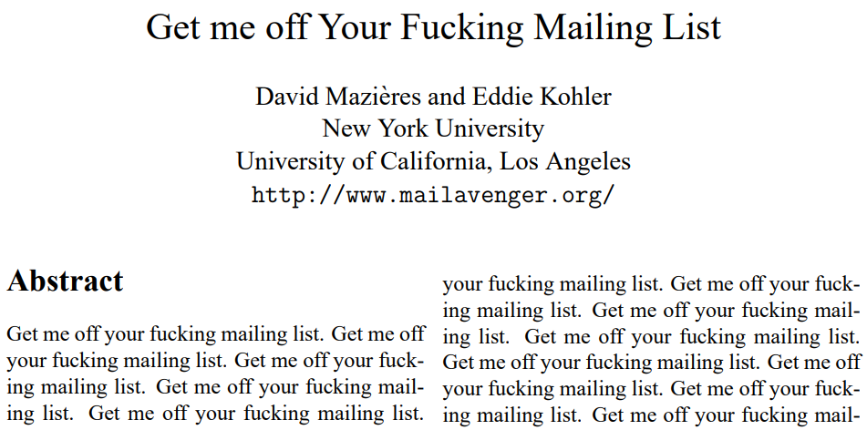
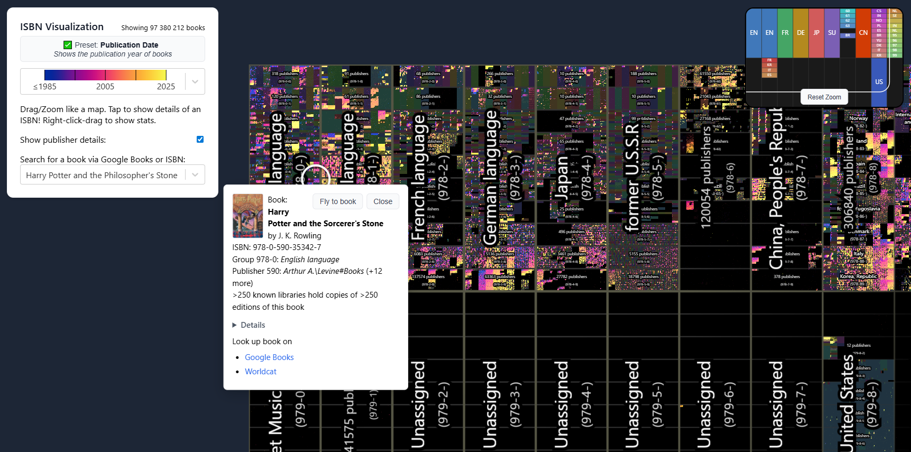

## The Illusion of Convenience

I recently bought an e-reader. Unlike an e-cigarette, you don’t need it to quit reading. In my head, I continued to live in 2016. Ten years later, the industry has moved forward. A modern e-reader is reasonably priced, is equipped with warm backlighting and a dark theme, offers quick internet access and automatic downloads, and has a highly customizable interface. There is also a translator, but it's hard for me to praise the built-in Bing when, instead of translating, it sometimes outputs the same word in transliteration...

But innovation is rarely purely positive. Under the guise of usability, the right to own books has been taken away from us. And not just them. What is written in this article also applies to other goods that have migrated to the digital environment.

The business model of traditional bookstores has largely remained unchanged over recent decades: retailers buy books from publishers in bulk and sell them to customers with a retail markup. With the development of the internet, this process has become much more efficient. Online platforms have emerged with access to extensive catalogs, convenient search, and home delivery options. Subsequently, a significant part of the market shifted to digital format: users got the opportunity to purchase and read books through official applications without leaving their rooms.

Thus, not only have we fallen into a **walled garden** (or, as is customary to say now, an ecosystem), but we have also ceased to own the things we buy. When I buy a paper book, I know it is mine. I can keep it at home (and it won't disappear), lend it to a friend, or sell it. All this is guaranteed by the **first-sale doctrine**. I am willing to pay a high price for a physical copy, as materials are required to produce it. We shouldn't forget about the secondary market either. For example, students buy textbooks for 200 dollars, knowing that at the end of the year they will be able to return part of the money by reselling the book to another student.

These customary rights do not exist when you buy e-books. And this is not hidden. In bold text right under the "buy" button, it says:

> By placing an order, **you are purchasing a license for the content**

Since the content is stored on someone else's servers, the retailer and publisher are able to modify or delete the purchased books at any time without notification.

The deletion of "1984" and "Animal Farm" is an iconic case. The books were sold in the Kindle Store, but it turned out the seller had no rights to them. Amazon deleted them from users' devices and refunded the money. Happy ending? Not quite. It became obvious that we do not truly own what we buy. This happens especially often within a subscription: a month later, a book can simply disappear if the publisher revokes the license.

I recently learned that some publishers make "modern" edits to texts. Today's reader might not understand the cultural references of the past, so they are replaced with current trends. In the "Pretty Little Liars" series, which was originally released in 2006, one of the characters mentioned the show "Fear Factor". In the new version, it was replaced by TikTok. I admit, it took me a second to remember that show myself. But that is the beauty of books—they are a time capsule. It made me feel nostalgic, and a young reader could go online and immerse themselves in the context of the period. But the publisher decided otherwise.

Sometimes changes even affect the covers. To advertise a new movie or series, the copyright holder replaces the classic e-book cover with a poster.

## Show Your Pass

Let's get back to ownership rights. What if I want to move the book to where it won't be altered? Or open it through a third-party program with a more convenient interface? Or let a friend read it?

According to the license agreement, this is prohibited. But even if you try, you won't succeed because of **DRM (Digital Rights Management)**. These are technical measures for copyright protection. DRM takes many forms and operates at the software and hardware levels. Its purpose is to prevent you from treating the file like a physical object. You didn't buy the file itself, but a temporary permission to view it under certain conditions. Hacking each DRM system is a separate complex process.

Companies invest enormous resources in protecting their content. These measures are financially justified. The platform generates enough profit to sell devices almost at cost (and older models at sales—even at a loss). The main income is generated through the store and subscriptions. By buying a gadget, you get tied to the ecosystem. The problem of cloud services depriving us of control was perfectly described by Cory Doctorow in his book "Enshittification":

> The ability of purveyors of cloud-based products to alter their terms, prices, and features at will enables one of the most beloved enshittification tactics of tech business leaders: **bait and switch**. If you operate a cloud-based app, you can monitor your customers’ every click and keystroke to discover which features are most valuable to your deepest-pocketed users, and then you can remove that feature from the product’s basic tier and reclassify it as an upcharged add-on.

> Every company is so sweatily insistent that you use its app rather than its website. An app is a website wrapped in enough IP to make it a felony to install an ad blocker or any other modification that makes the product work better for you at the expense of the company’s shareholders.

It is not surprising that amidst such practices, the slogan gained popularity: **"If buying isn't owning, piracy isn't stealing"**. But the truth is that a balance can always be found. It's not necessary to resort to radical solutions that harm authors.

## The Alternative

Sometimes an unprotected book can be bought on the author's website, bypassing platform commissions. If the author doesn't have a website, you can use two excellent services: Project Gutenberg and Libby.

Project Gutenberg is the world's oldest free digital library. It stores works that have entered the public domain. The project is named after Johannes Gutenberg, the inventor of the printing press. Before him, books were copied by hand, which was incredibly expensive. Thanks to his invention, knowledge became mass-produced and accessible.

The project's founder, Michael Stern Hart, decided in 1971 that literature should be available to everyone through computers. Back then, it seemed like madness: there was no web, no convenient formats, and texts were typed manually. Without cameras and OCR (Optical Character Recognition). Today, Project Gutenberg contains over 75 thousand books.

Due to copyright laws, you will find almost no modern literature there. Therefore, it's worth knowing about the Libby app. In this app, you can read and listen to books for free using just a library card. The system mimics real life: each book has a limited number of digital copies. If all are occupied, you get in line. When your turn comes, you can rent the book. Usually for a period of one to three weeks. A book appears in the app when your local library buys a license from the publisher. So, your location plays a major role here. Surprisingly, the city library in my town turned out to be connected to the system. Apparently, my taxes accidentally did something useful.

Both services are legal. But there are also so-called **shadow libraries**—services providing access to content bypassing copyright. The largest of them is Anna's Archive. It's more of a search engine than a repository: the archive aggregates data from other pirate libraries. The project allows you to find almost any book, but how does it survive under legal pressure?

## I Know a Guy Who Knows a Guy

On their blog, the library's creators shared that they use cheap servers accessed through **"freedom-loving" proxies**. A proxy server does not store files, but only redirects requests, hiding the end node:

> One somewhat freedom-loving company that has put itself in an interesting position is Cloudflare. They have [argued](https://blog.cloudflare.com/cloudflares-abuse-policies-and-approach) that they are not a hosting provider, but a utility, like an ISP. They are therefore not subject to DMCA or other takedown requests, and forward any requests to your actual hosting provider. They have gone as far as going to court to protect this structure. We can therefore use them as another layer of caching and protection.

In addition, there was an attempt to use **IPFS (InterPlanetary File System)**. This is a decentralized P2P protocol that allows storing and sharing files without a central server. In the regular web, to download a file, you have to go to a specific server. If the server disappears tomorrow, access to the file disappears with it. In IPFS, content is searched not by location (URL), but by a unique hash generated based on the content. The file itself is distributed among users' computers (nodes), similar to torrent technology. If one node goes down, the data remains accessible from other nodes where it was cached.

It sounds great on paper. Decentralization! But the gap between the idea and reality turned out to be large. Anna's Archive stores millions of files. That's hundreds of terabytes of data. IPFS is not exactly designed for such a scenario. A standard site uses a database where a book's title points to a file, and an author's name points to a list of their books. When searching for "The Cuckoo's Egg," the server immediately knows where the file is, who the author is, and what versions are available. In IPFS, there is no semantic search. A file can only be retrieved by knowing its hash. Therefore, an index is needed. IPFS without it is like a huge warehouse without a catalog.

This catalog is the **DHT (Distributed Hash Table)**. You ask the network: "Hey, who knows this file? Its hash is QmRAQB6YaC...". Your node selects several nodes closest to this hash (according to a special distance rule in the hash space) and asks them. Then these nodes do the same, but not to everyone in a row, but again only to those closer to the goal. Thus, the request gradually approaches the right place in the network.

This works, but sometimes there can be problems. Since the network is distributed, your request can wander through the network for a long time. Some nodes may be turned off. Or the file may be completely deleted. The file itself doesn't live in the network. It is stored in a node's cache. A node can clear its cache at any moment to free up space. To prevent this from happening, the file needs to be **pinned**. Pinning is like telling your node: "This file is important. Do not delete it under any circumstances". As long as at least one node keeps the file pinned, it can be found and downloaded. If no one pins it, the file technically still exists (it has a hash), but it can no longer be downloaded. It's simply unavailable to anyone.

The BitTorrent protocol has a culture of seeding. I downloaded an interesting file, which means I will seed it for other similar enthusiasts. On many trackers, you can get banned if you only download all the time but don't upload anything back. In IPFS, people rarely run nodes. Everything rests on enthusiasm. There is an attempt to push people to support the network, but it works poorly.

The easiest way to spur people to do something is a financial incentive. For this, **Proof-of-Storage** was invented—a cryptographic consensus mechanism. Based on it, networks are built where special tokens operate. They can be earned by storing someone else's file on your node. And then spent to store your own file on someone else's node.

In the end, for IPFS to really work, it was necessary to pin all files, monitor replication, and add an economy. This turned everything into a centralized system, but more complex and worse. Anna's Archive kept some links, but made the main access via direct HTTP downloads. Separately, the site publishes giant torrents, but they are not intended for specific books, but to preserve the entire library. If the site closes, a copy can be spun up from its source code and these torrents. Currently, 86% of the total volume of 1.1 petabytes is backed up in at least 4 locations, and only 11% in more than 10 locations.

## Everyone Pays!

The problem of rights and access in the scientific world is even more acute. The scientific community, which is supposed to be open, is managed by a business with a strange economy. The research process looks something like this:

1. A scientist writes an article (usually for free, as it is part of their job)
2. Sends it to a journal
3. The journal initiates a **peer review**, where other scientists (also for free) check the work
4. After revisions, the article is published

All scientists transfer their articles to publishers free of charge; no royalties are provided. Universities, on the other hand, pay huge amounts for access. One journal can cost thousands of dollars a year. A subscription package will already cost millions of dollars a year. A large university can pay from 1 to 10 million dollars a year for access to scientific databases and archives.

This is a very strange scheme. The journal takes money from both readers and authors. It turns out that the state and universities pay scientists to produce texts, and then publishing groups sell them access to these same texts for millions of dollars. This generates massive profits. Some top journals have margins comparable to Big Tech (30-40%).

The career system of scientists is tied to publications. The aphorism **"Publish or Perish"** has emerged in the community. The **Impact Factor (the average citation frequency over a certain period)** is important, rather than always the quality of the work itself. This creates incentives for citation manipulation and publishing for the sake of publishing. When issuing a grant, scientists are set certain conditions and KPIs. One of them is the number of articles. Often, the result of a study will only be ready in a couple of years. And it can be published in a respected journal. But all this time, sponsors are waiting for reports on the work done. A study that could be presented in one article has to be broken down into several publications. Because of this, integrity suffers. Such intermediate articles have low value and originality.

In recent years, some publishers have moved to a new **open-access** system. In it, all articles are free, but the author pays for the publication. This money covers all the journal's costs, while the scientist retains the copyright. The dark side of this alternative system was well described by biologist Alexander Panchin:

> Of course, there are a bunch of good, reputable open-access journals where first-class articles come out. But the paid publication system has also spawned an entire industry of predatory, garbage journals whose sole purpose is to rip off money from obscure or novice authors. At the same time, they reach outright scams. They ruthlessly spam all scientists, invite just anyone to be reviewers and editors, do not monitor the quality of reviews at all, accept absolutely any articles (they don't even check for plagiarism)... and in general drop the overall level of publications to the very bottom.

> Two scientists got so fed up with "scientific" spam that they wrote an article for a garbage journal titled "Get Me Off Your Fucking Mailing List". With very descriptive illustrations. And this article was accepted into the journal.

In 2011, programmer and researcher Alexandra Elbakyan founded Sci-Hub. It was the largest and most convenient pirate resource where you could view scientific papers for free. Usually, through university subscriptions, copies of articles were saved and uploaded to Sci-Hub for free. In personal correspondence, you can even ask the author of the study for a free copy of the article, since when it's purchased through the journal, they don't get a penny.

The site gained immense popularity because most people don't have access to the journals. Even universities don't always have full access due to funding issues. Sometimes I wonder if I was taught to work in the free open-source engineering software Scilab because the university didn't have money for a Matlab subscription.

Sci-Hub has been sued multiple times by publishers. This led to the site ceasing to publish new articles in 2022. Its successor became the pirate SciDB from Anna's Archive.

## Where's the money, Lebowski?

To keep the site running, for a donation, Anna's Archive gives high-speed access to the entire library. This is usually used by organizations to train large language models. One such company was DeepSeek.

The project also stimulates the community itself. At the end of 2024, they held a competition to visualize all the ISBNs (International Standard Book Numbers) in the world with a prize pool of 10 thousand dollars. First place was taken by Phiresky. His blog has a wonderful post about an interactive map of the book space: [Visualizing all books of the world in ISBN-Space](https://phiresky.github.io/blog/2025/visualizing-all-books-in-isbn-space). It used a lot of mathematical tricks.

For a relatively long time, Anna's Archive did not attract attention, but after suddenly downloading all of Spotify (or as they joked then: a free remote backup), major music labels took on the site. Although I was born in 2001, I know what kind of war was waged between the Big Three (Universal Music Group, Sony Music, and Warner Music Group) and Napster. Anna's Archive domains immediately began to die one after another, the site was subjected to DDoS attacks, and the damages sought totaled 322 million dollars. At the time of writing this article, the shadow library continues to operate.

## Partial Win-Win

Everyone decides the issue of the ethics of piracy for themselves. This article does not call for downloading books from shadow libraries. Copyright is an old and sometimes absurd system, but authors need to be supported. There are ways to truly own your files; they are just slightly more complicated than clicking a button in a proprietary store.

The streaming and digital store economy has made the "purchase" of content essentially a license: users receive a limited right of access, not eternal ownership. This creates the risk of losing access if rights change or the service closes. DRM and the terms of license agreements are used to lock content inside platforms, which increases user dependence and reduces competition.

Such a model is beneficial to copyright holders: instead of fluctuating revenues, they receive a more stable and predictable cash flow. Banks operate on a similar logic: early repayment of a loan or mortgage can be accompanied by penalties, as this disrupts their expected financial flows and calculations.

We need **open formats** for digital purchases so that users can transfer purchased content between services or store it locally. Podcasts, calendars, and email are good examples of **interoperability (cross-platform compatibility)**. You choose an email client based on the convenience of the interface and features, and not because only a specific application is capable of sending a letter to your friend. This model should also spread to streaming and messengers.

The history of Microsoft’s e-book store is a short but illustrative case about digital purchases and their limitations. Microsoft launched its e-book sales in 2017, but due to a weak ecosystem (reading was only available through the Edge browser, with no mobile apps) and strong competition from Amazon’s Kindle, the project quickly failed. By April 2019, the store was shut down, and in July 2019 users completely lost access even to the books they had purchased, receiving full refunds. This clearly demonstrated that in digital services, you often don’t actually buy the file itself, but rather a temporary license for access that can disappear.

## Post Scriptum

While writing the text, I came across an idea: why not print a QR code on paper books for instantly getting an electronic version?

It sounds logical, but there's a legal nuance that gets in the way. When buying a paper book, you become the owner of a specific physical copy, and not a universal right to the work in all formats.

Therefore, the idea of transferring the purchase of a book to an e-reader runs into a model of rights and agreements between publishers, platforms, and users, rather than technology. A paper book and an electronic version are legally considered different products, even if to the reader it's just the same text in a different package.
