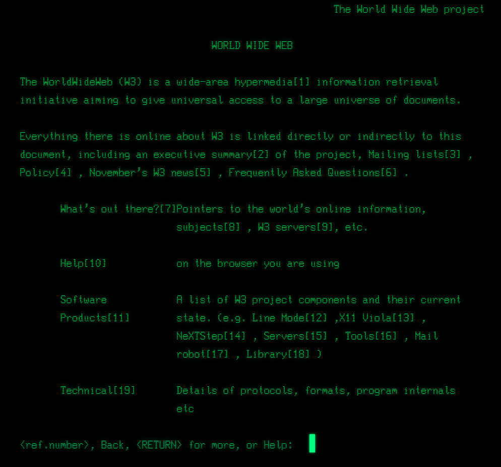
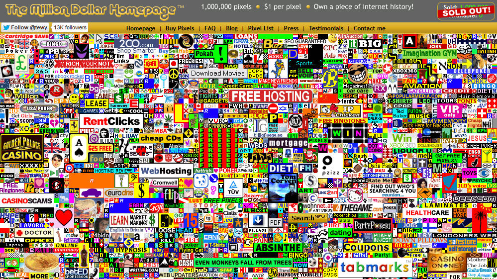
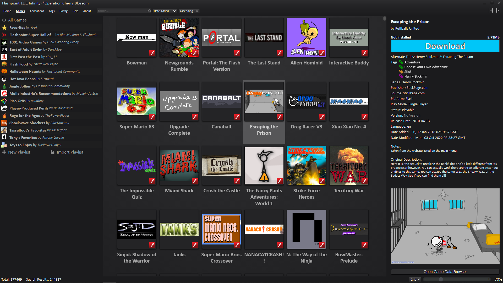
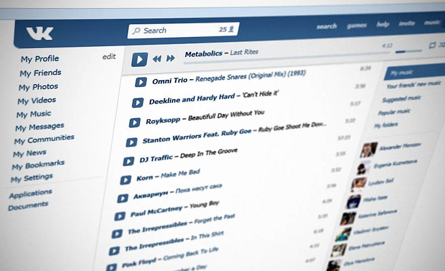

## The Tale of the WWW

Everything on the internet is forever... For a long time, this statement was considered one of the foundational principles of the digital world. But today, after decades of technological evolution, it is becoming increasingly difficult to hold on to that certainty.

To understand the scale of the problem, we need to distinguish between two concepts: the internet and the World Wide Web. The internet is a global infrastructure (cables, protocols, servers) created in 1969 to enable remote communication between computers. The World Wide Web (WWW), whose abbreviation takes longer to pronounce than the full name, appeared only in 1989 and became an overlay on top of the existing network. In his book "This Is for Everyone", the creator of the WWW, Sir Tim Berners-Lee, described the digital landscape of that era as follows:

> Before the web, the preferred method for getting information from another computer was the File Transfer Protocol. There was a lot of stuff available on FTP servers, from open-source code to online books to visual art. People with software projects would run an FTP server – say ftp.acme.com – then encourage people to get the software by saying something like 'log into ftp.acme.com and then go to directory pub/code, and then get sparkle.c'.

> But this method was inherently slow. You had to open a control connection to a server on another computer, then select the directory on the server you'd reached, then say you wanted to get a file, and then the client would open a separate connection to the server. Each connection would take a certain amount of time, depending on how far across the world the server was. It also demanded multiple inputs from the user – logins, passwords, directory navigation and downloads. Obtaining a file from an FTP server for the first time often took about a minute. With the web, I was aiming for a tenth of a second.

That is why the WWW concept was revolutionary. At its core was the linking of resources through hyperlinks: one click allowed you to jump instantly to an object without knowing its contents in advance. The idea of links itself came from the academic environment to which Berners-Lee belonged, where citing colleagues' work is standard practice. Notably, the first cross-platform browser had no graphical interface and worked through a terminal. To follow a link, you had to enter its serial number and press Enter. You can try a simulation of this client on the [CERN](https://line-mode.cern.ch/www/hypertext/WWW/TheProject.html) website.



## Link Rot

The critical vulnerability of external links is that the source and the destination are physically located on different machines. These servers are operated by people and require uninterrupted power, which entails financial costs. If the host goes offline, the data can be lost forever. This phenomenon is known as **link rot**. In theory, scientific papers are subject to the same problem, but in practice the risk is reduced through duplication: a link does not point to a unique copy held by a private individual, but to thousands of identical copies in libraries.

On the internet, however, any resource is vulnerable. A personal page run by an enthusiast can disappear, as can a giant project with a long history. A classic example is the shutdown of GeoCities, but for my generation Vine's death was the more resonant one. Both projects belonged to tech giants (Yahoo! and Twitter, respectively), yet were shut down because they were no longer profitable.

It is a mistake to think that modern social networks are protected from a similar fate. The bitter truth is that a huge amount of content has already been lost. The reasons range from the difficulty of storing colossal volumes of data (photos and videos) to changes in platform policy (censorship) or technical disasters (fires in data centers).

Instagram has already suffered incidents of massive user-data loss. In one case, due to a server error, Stories turned into black rectangles. In another, content from 2017 to 2022 was replaced with static screenshots without notifying the authors.

In 2005, the website [The Million Dollar Homepage](https://milliondollarhomepage.com) went viral. For just 1 dollar, you could buy 1 pixel on a digital canvas and place a link on it. The site contained 1 million pixels, and its creator planned to raise a million dollars to pay for his education. The project quickly reached its goal; however, according to a 2025 db8 study, about 60% of all the links placed there now lead to websites that no longer exist.



## Digital Archivists

In response to these challenges, a movement of digital archivists emerged, whose mission is to preserve any data whatsoever. It is a resource-intensive effort that rests on the shoulders of enthusiasts. Sometimes the administrators of shutting-down services allow users to export their data with a single click, but more often volunteers have to build archiving tools themselves. This requires deep expertise in both software and hardware: the server racks in the home labs of many movement participants are no less impressive than those in industrial data centers.

What medium can reliably store such a huge amount of information? The answer may surprise the uninitiated: magnetic tape. The very technology that decades ago was pushed out of the consumer sector by HDDs and SSDs. Familiar storage devices are not suitable for long-term retention over a span of 10, 20, or 30 years. Hard disk drives (HDDs) contain many moving mechanical parts, while solid-state drives (SSDs) require regular refreshing of the electrical charge in their cells. Magnetic tape loses to them in capacity and access speed, but those parameters are secondary in archival storage.

For example, Amazon S3 Glacier Deep Archive offers what is known as "cold storage". Unlike "hot" storage, where data is available instantly, access to "cold" archives can take from several hours to several days. It is the most economical storage method. Sometimes slow HDDs are used together with tapes. The low data-read speed is an advantage here: the mechanical parts wear out more slowly, which extends the drive's lifespan. In addition, reading in such systems usually happens sequentially (large backups) rather than randomly, which allows even slow drives to deliver respectable performance.

## It All Comes Down to Copyright

Beyond the technical aspects of storage, the question of selection arises. The archivist community follows the principle of "preserve EVERYTHING", because the value of information is unpredictable in historical perspective. However, this approach inevitably collides with the legal framework. Rights holders are often hostile to the collection and distribution of their materials without permission. At the same time, activists point to corporations' inability or unwillingness to manage their own heritage properly. This applies to old TV shows gathering dust in studio archives, books that have not been reprinted for decades, or games no longer supported by modern platforms.

In such scenarios, the community sees its role as restoring access to files for future generations. According to the Library of Congress, **75% of all Hollywood silent films are lost forever**, because studios saw no value in them. After premieres, the film stock might have been processed to extract silver or simply destroyed to free up warehouse space.

A symbol of the careless treatment of cultural heritage was the Fox archive fire in 1937. Because highly unstable nitrate film ignited, the fire destroyed thousands of reels. In official statements, the studio focused on the material damage, almost entirely ignoring the loss of film history. Historians only realized decades later that a significant portion of early Hollywood had vanished.


Thanks to the efforts of enthusiasts, many works were saved. Fans of Nintendo, Sega, and other retro consoles created emulators and dumped almost complete libraries of the games from those years. These projects cannot be found in official stores or even on the second-hand market. A telling example is the release of PlayStation Classic in 2018: Sony used the open-source PCSX ReARMed emulator and poor-quality game dumps. This triggered a wave of criticism from fans, since the incorrect frame rate caused lag. The company was accused of rushing the product and trying to cash in on nostalgia while using fan-made work even though it had access to the originals.

An interesting technical fact: in early revisions of the PlayStation 2, no emulation was required to run first-generation games. The console integrated the original hardware from the first PlayStation: when old titles were launched, the MIPS R3000A processor was activated, and the game effectively ran on native hardware.

## Personal Sorrow

As a fan of Japanese culture, I am especially saddened by the lack of a high-quality remaster of the cult Dragon Ball franchise. The original show ran from 1986 to 1997. Official remasters from Toei Animation suffered from many problems: mediocre audio tracks, cropped framing (the shift from 4:3 to 16:9), crude upscaling, and artifacts from AI noise reduction. But the critical factor was color reproduction. The original film reels were either lost or stored under improper conditions, which caused the colors in the new releases to be distorted by copying defects from old media.

Toei Animation did not invest enough resources into restoring a work recognized as the gold standard of the Shōnen genre. As a result, six years ago the Kineko Video group launched a large-scale project to search for the original film reels. Their journey resembled the plot of the anime itself: searching for rare film reels on eBay and Reddit. Professional equipment was purchased for digitization, and the result was the world's first 4K Dragon Ball remaster. For the first time since 1986, the show can be seen in the form its creators intended. And although the materials found cover only a small portion of the series, they show what the project could have looked like if the rights holder had treated it with care.


The situation with Israeli series created by the studio whose work is close to me is even sadder. Niche content has a small fan base, which makes large-scale restoration projects difficult. Yet history knows examples of lone individuals succeeding against systemic obstacles — a kind of David and Goliath story.

For viewing, I have two options: pirated 2008 recordings in 360p, or official streaming. In the latter case, the viewer gets either the result of aggressive AI processing that erases background details and distorts actors' faces, or a transfer from the original film reels cropped to 16:9. Modern streaming platforms somehow avoid preserving the original 4:3 aspect ratio, which means up to 25% of the frame is lost, subtitles cover the image, and the characters' faces in dialogue fill the entire screen, creating visual discomfort.

Many materials are not available at all, remaining locked in television archives for formal reasons: low demand or legal complications. That is precisely why there became a need for a "third party" that preserves cultural heritage and provides unrestricted access to it. In addition to Anna's Archive, which I wrote about earlier, it is worth examining other key groups in more detail.

## Internet Archive

The most authoritative organization in this field is the Internet Archive, founded in 1996 by programmer Brewster Kahle. Its ambitious goal is to preserve EVERYTHING. In 2001, the Wayback Machine was launched, allowing users to view past versions of web pages. Special search robots (crawlers) create snapshots of websites and store them on servers. Unfortunately, dynamic content, closed communities, and paywall systems remain difficult to archive automatically. Over time, users themselves began actively uploading books, broadcasts, games, and software.

To manage such massive amounts of data, the Internet Archive developed its own Petabox system, designed for maximum storage density and minimum cost. Instead of the RAID arrays typical in the corporate sector, it chose the **JBOD (Just a Bunch Of Disks)** approach. The system scales horizontally with ease: each node not only stores data but also helps process it (through indexing or distribution to users). Physically, the servers are located in a former church building in San Francisco, which gives the organization a special character.

Inside the organization, the ARC and WARC formats were created. If ARC was a simple log file, WARC became the modern standard. It preserves not only the site's content but also the context of the request: metadata, crawler parameters, session settings. WARC turns records into a data graph, making it possible to connect requests with responses and original resources.

```text
WARC/1.0
WARC-Type: response
WARC-Target-URI: https://netpreserveblog.files.wordpress.com/robots.txt
WARC-Date: 2020-03-19T18:56:13Z
WARC-Payload-Digest: sha1:HLNR6AWVWYCU3YAENY3HYHLIPNWN66X7
WARC-Record-ID: <urn:uuid:0c384363-10db-42d2-b739-e86253721789>
Content-Type: application/http; msgtype=response
Content-Length: 373

HTTP/1.1 301 Moved Permanently
Server: nginx
Date: Thu, 19 Mar 2020 18:56:13 GMT
Content-Type: text/html
Content-Length: 162
Connection: close
Location: https://netpreserveblog.wordpress.com/robots.txt

<html>
<head><title>301 Moved Permanently</title></head>
<body>
<center><h1>301 Moved Permanently</h1></center>
<hr><center>nginx</center>
</body>
</html>
```

In addition to digital assets, the Internet Archive maintains a physical repository of books, cassette tapes, vinyl records, and retro computers. Many artifacts are waiting their turn to be digitized under strict climate control. Stable temperature, low humidity, and the absence of sunlight protect paper and film from degradation.

The Internet Archive has done enormous work in fighting link rot. One of its most significant achievements was its collaboration with Wikipedia: special bots scan articles and automatically replace broken links with their archived copies in the Wayback Machine, saving millions of citations from disappearing.

## Flashpoint Archive and Ruffle

Flash content posed a special challenge for archivists. From the late 1990s to the early 2010s, Flash was the foundation of the interactive web, powering games, animations, and video players by bypassing the limitations of the browser APIs of the time. But the technology was burdened with critical vulnerabilities. While HTML and JavaScript ran inside the browser's protected sandbox, Flash was a third-party plugin.

The infrastructure consisted of a player installed on the system and SWF files on websites. It was a catastrophe from a security standpoint. Flash Player was effectively a virtual machine inside the browser that ignored standard rendering mechanisms. Any error in parsing the binary structures of SWF files could lead to buffer overflows or incorrect memory reads. Moreover, bugs in JIT compilation allowed attackers to achieve arbitrary code execution.

```actionscript
function calculate(x:*) : int {
    // The JIT hopes that x will always be an int
    return (x + 1) << 2;
}

// The JIT creates a fast path for integers
for (var i:int = 0; i < 100000; i++) {
    calculate(i);
}

// Passing a floating-point number breaks the JIT's assumptions
calculate(1.5);
```

With access to the operating system through plugin APIs, an attacker could easily break out of the sandbox and infect the victim's machine. Flash supported video, audio, 3D, sockets, and file-system access — each subsystem expanded the attack surface. In the era of mass internet adoption and global virus outbreaks (such as the Blaster worm), attitudes toward security changed. Microsoft and Netscape began major refactors of their products, but Adobe limited itself to Flash patches. Users rarely updated, and the company feared breaking backward compatibility with a format created back in the late 1990s.

The final blow came when Apple refused from supporting Flash in its mobile browser because of security problems and the extreme power consumption it caused on the weak batteries of the first iPhones. Interactive sites of that era were also not optimized for touch control.

The gradual death of Flash was a huge loss for internet culture. Archiving was made difficult by the fact that after December 31, 2020, player support ended everywhere. Without the player, an SWF file is just a pile of bits. On top of that, the format was dynamic and could load parts from external sources. The content "existed", but it could not be opened. What had to be archived was not only the files, but also the execution environment.

The community responded by creating two projects: Flashpoint Archive and Ruffle. Flashpoint is not just a library, but a complete local ecosystem. Because old games often depended on specific domains and external resources (CDNs, APIs), the project emulates the network environment by spinning up fake servers. All requests are intercepted and redirected to local storage. In addition to Flash, the project supports Unity, Java applets, HTML5, and ActiveX, and its collection includes more than 200,000 applications.



Ruffle is a modern Flash emulator written in Rust. Its goal is to safely run SWF files in the browser without using the original plugin. The project was built through reverse engineering and open specifications. In the browser, Ruffle runs through WebAssembly, executing code in an isolated environment. Although 100% compatibility has not yet been achieved, the Internet Archive already uses this engine to play Flash content online.

## The Dilemma of Volume and Quality

The second fundamental problem of archiving is the shortage of disk space. The principle of "preserve EVERYTHING" requires enormous amounts of storage, especially when data duplication is necessary. Archivists often have to make compromises. In the world of video games, repackers often cut out unnecessary localizations, bonuses, and 4K textures to reduce file size. A similar situation occurred with the music catalog of Anna's Archive.

At the end of 2025, Anna's Archive announced that it had finished copying almost the entire Spotify music library. The selection was based on track popularity: hits were preserved in OGG Vorbis at 160 kbps, while less popular tracks were re-encoded into OGG Opus at 75 kbps. For many, this is a forced step of initial preservation, but for music lovers it is a source of sadness.

Those who used the music section of VKontakte in the 2010–2015 period remember it as a unique layer of content. There one could find the rarest recordings: from covers by provincial musicians to student rock. This content is not aimed at the mass market, but it has enormous cultural value for small communities.



Here **Pareto's law** comes into play: by preserving the 20% of information that is most in demand, we satisfy the needs of 80% of users. However, the true goal of archiving is the remaining 80% of data that matters to the 20% of connoisseurs, including fans of niche TV series from small countries.

Already some groups understand this and are moving toward preserving all content without quality loss. One such step is the transition to new formats that, for now, are not supported everywhere or require greater computing power, but produce files with a lower final size.

Compression algorithms always balance speed and file size. MP3 used to encode more slowly than MP2, but it produced smaller files and better quality — and the bet on rising computer power proved correct. Today the situation is similar: data volume is growing faster than disks, but computing power is increasing even faster, so "heavier" algorithms are becoming advantageous.

Because of this, modern formats such as WebP and AV1 are gradually replacing JPEG and MP4. WebP reduces image size by 25–35% without quality loss, while AV1 provides roughly 30% better video compression than HEVC/VP9. Google, Netflix, and YouTube already use them extensively, but mass adoption is slowed by compatibility with older devices, the need to store multiple versions of files, and the heavy workload of AV1 encoding.

This transition is driven not only by ideology but also by economics. The main advantage of the new formats is that they are free. Unlike H.264 and H.265, for which device manufacturers and streaming services pay licensing fees, AV1 and WebP are **royalty-free**. It was precisely the patent restrictions of older codecs that pushed the industry to create AV1.

A simultaneous problem and virtue of the internet is that compatibility matters more to it than efficiency: old JPEGs and MP4s open almost everywhere. That is why large services usually use "smart switching" — new devices get AV1, while older ones continue to use H.264.

## Non-Classical Lossy Compression

In the context of archiving, the role of artificial intelligence is also worth considering. Large language models in their current form are a kind of "lossy archive". If in the past you needed access to a specific website to find information, now a chatbot can provide details that, while not identical to the original source, convey its essence. Here too Pareto's law applies: for most tasks, such a retelling is sufficient.

The weights of neural networks contain millions of articles, books, and descriptions of works of art. Yes, it is an inaccurate retelling, prone to hallucinations, but it is still another barrier against the complete oblivion of information.

## We Can Do It!

The difficulty of preserving data lies in the fact that we never know in advance which pieces of knowledge will become critically important tomorrow. Total archiving of the internet is a titanic task requiring unimaginable resources. But if, 50 or 100 years from now, even one fragment of that data benefits society, the effort will have been worth it. Our education system is built on the same principle: we accumulate knowledge without knowing for sure which parts will be useful. Preserving digital culture is an investment in our shared future.
