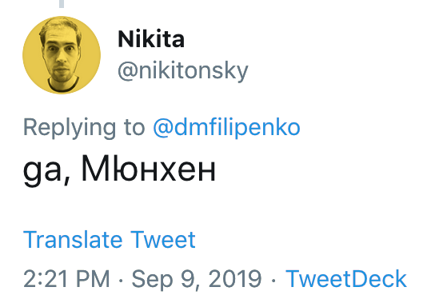

Раньше проблемы требовали элегантных решений. Мы были ограничены мощностями железа и труднодоступностью готовых ответов. Раньше нельзя было просто натравить на задачу искусственный интеллект и получить красивый результат. На самом деле этого нельзя делать и сегодня, иначе не хватит токенов на все это благо. Программисту приходилось подтверждать звание инженера и придумывать хитрый алгоритм, который спасет его. В один такой любопытный алгоритм я и углубился на днях.

Вы никогда не задумывались: откуда «Гугл Переводчик» знает, какой язык я ввел? Да, сейчас ответ простой — ИИ. Но до него все равно прогоняется несколько простых, но эффективных проверок на базе статистического анализа. Классическое решение строится на **n-граммах**. Я сэкономлю вам время и приведу цитату из Википедии:

> N-грамма — последовательность, состоящая из n элементов, которые могут быть звуками, слогами, словами или буквами, в зависимости от контекста.

Давайте попробуем разбить слово `Hello` на буквенные биграммы. Префикс би- означает бинарный. То есть мы будем искать все группы, состоящие из двух символов. Всего их 4: `he`, `el`, `ll`, `lo`. N-граммы бывают разных видов:

| Тип                 | Примеры                    |
| ------------------- | -------------------------- |
| Буквенные биграммы  | `th`, `er`                 |
| Словесные биграммы  | `to the`, `in the`         |
| Буквенные триграммы | `the`, `ing`               |
| Словесные триграммы | `one of the`, `as well as` |

Для каждого языка характерны свои цепочки. Униграммы и биграммы слишком часто пересекаются между родственными языками. Квадриграммы встречаются реже и требуют больше памяти для хранения в базе данных. А вот триграммы позволяют безошибочно отличить испанский от итальянского. Чем длиннее цепочка, тем точнее идентификация. Обычно больше 3 элементов подряд использовать нет смысла. Но есть задачи, где пригождаются и более длинные последовательности.

Алгоритм не пытается понять смысл текста, он ищет частотные маркеры. Особенно это полезно в таких языках, как китайский. В нем нет пробелов между словами. Текст идет сплошным потоком, поэтому концепция слова здесь размыта. Алгоритму это неважно, так как он легко разбивает такой текст на n-граммы.

Забавный случай, связанный с некорректным определением языка, происходит в Twitter. Очень часто мне попадались твиты на русском с очень странным написанием. Буквы были кириллические, но какие-то другие. Оказалось, что это **болгарица** — болгарская кириллица. Она была создана для увеличения идентичности болгарской письменности и является мостом между латинским и русским алфавитами.

Русский и болгарский языки — это классический кошмар для статистических алгоритмов определения языка. На уровне биграмм и триграмм они похожи настолько, что короткую фразу компьютер может легко перепутать.

Оба языка используют кириллический алфавит. Для алгоритма, который сначала группирует языки по используемым символам, они попадают в одну и ту же группу. Более того, в болгарском языке нет уникальных букв, которых не было бы в русском (в отличие, например, от сербского с `ђ`, `ћ`, `џ`). Вдобавок у них большое пересечение буквенных триграмм.

Но все же есть несколько маркеров, которые позволяют отделить первый язык от второго. Один из спасителей — это буква `ъ`. В русском она встречается крайне редко, в то время как в болгарском это полноценная и очень частая гласная. Буква `ы` моментально исключает болгарский, так как ее там нет.

В коротких сообщениях Twitter не всегда удается точно определить язык твита. В таком случае он ставит в HTML тег `lang="bg"` и заставляет браузер рендерить болгарицу для текста.

N-граммы очень полезны. Они активно используются в предиктивных алгоритмах ввода, когда на основе предыдущих слов клавиатура предлагает варианты следующего. Этот же алгоритм используется при оптическом распознавании символов. Когда компьютер сканирует неразборчивый печатный текст, он может сомневаться в конкретной букве. Например, символ `l` (L) похож и на `1` (один), и на `I` (i большая). OCR-движок смотрит на буквенные n-граммы вокруг. Если левее стоят буквы `w` и `i`, алгоритм выберет `l`, так как триграмма `wil` (will) статистически сверхпопулярна, а `wi1` в языке не существует. Та же логика работает при распознавании речи.

Нашлось им применение и в биоинформатике для анализа ДНК. ДНК любого живого организма — это гигантский сплошной текст, состоящий всего из четырех «букв» (нуклеотидов: `A`, `T`, `C`, `G`). Здесь нет пробелов, прямо как в китайском языке, поэтому n-граммы (в биологии их называют **k-меры**) стали ключевым инструментом.

В кибербезопасности они полезны для сигнатурного и эвристического анализа файлов. Только вместо букв или слов анализируются последовательности байтов или системных вызовов. Также ранние спам-фильтры обучались на n-граммах. Связки слов вроде «перейди по ссылке», «купи сейчас» в сочетании с высокой частотой буквенных n-грамм из капслока сразу отправляли письмо в корзину.

Интересными являются попытки деанонимизации создателя Bitcoin Сатоши Накамото. Сатоши оставил много примеров текста на ранних криптовалютных форумах. [В статье The New York Times](https://www.nytimes.com/2026/04/08/business/bitcoin-satoshi-nakamoto-identity-adam-back.html) попытались применить методы **стилометрии** для определения авторства тех сообщений. В ней журналист пришел к выводу, что Адам Бэк — это Сатоши Накамото. Они оба допускали одни и те же редкие ошибки в использовании дефисов. Они также совпадали в выборе британских и американских вариантов написания ряда слов. Ни одна из этих деталей сама по себе ничего не доказывает, но вместе они образуют своего рода статистический отпечаток, который и призвана выявлять стилометрия.

У меня всегда была слабость к таким элегантным алгоритмам. Они напоминают нам, что некоторые из самых красивых идей в информатике не требуют огромных нейросетей или суперкомпьютеров. Иногда достаточно лишь удачного наблюдения, немного математики и инженера, готового мыслить нестандартно.
